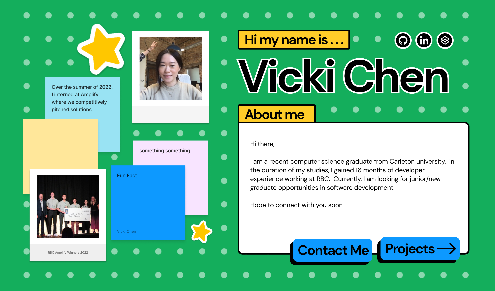

# My Personal Website

This project was designed on figma, then brought to life using React.js and Styled-Components.

## Figma Mockup

Here you can see the mockup of the design. Currently the website is in progress, but it looks quite close to the original design!

### Running the website

To start, open the project up and run:
- npm install
- npm start

this runs the app in the development mode.\
Open [http://localhost:3000](http://localhost:3000) to view it in your browser.

The page will reload when you make changes.\
